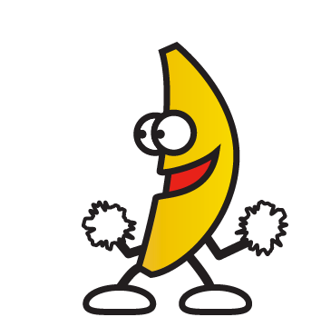

gifplayer
===========
[](http://badge.fury.io/bo/jquery.gifplayer)

Customizable jquery plugin to play and stop animated gifs. Similar to 9gag's.
New: Video support (webm, mp4)

###Basic Usage

1. Add a preview of the gif or video file to your website
2. Specify a ‘data-src’ attribute with the path to the animated gif or video, or simply have an image with the same name and the .gif extension in the same folder of the ‘preview’ image
3. Include jquery.js, jquery.gifplayer.js and gifplayer.css on your site
4. Call the .gifplayer() method for the desired images

```html

 
<script>
	$('.gifplayer').gifplayer();
</script>
```

###Options

Options can be setup in two ways: 
1. Setup as an object when initializing the plugin: 
```javascript
$('.banana').gifplayer({ label: 'play' });
```

2. Setup as data attributes in the preview image: 
```html

```

Option	|Values	|Default | Allowed values
--- | --- | --- | ---
label	| A value for the label in the circle over the image	|‘gif’ |
playOn	| Event that triggers playing the animated gif	|'click' | 'click', 'hover'
mode | Load an animated gif file or a video | 'gif' | 'gif', 'video'
gif | Source for the gif file | Default option is the same name of the preview imagem replacing extension to .gif |
mp4 | Source for the mp4 video file (video mode)| Default option is the same name of the preview imagem replacing extension to .mp4 |
webm | Source for the webm video file (video mode)| Default option is the same name of the preview imagem replacing extension to .webm |
wait | Would you wait until the animation file has been fully loaded to play, or start playing right away | false | true, false

###Methods (beta)

Use these methods to play and stop the player programatically 

```javascript
$('#banana').gifplayer('play');
```

```javascript
$('#banana').gifplayer('stop');
```

###Events (beta)

Use events to do awesome things 

```javascript
$('#banana').gifplayer({
    onPlay: function(){
        console.log('GIF started',this);
    },
    onStop: function(){
        console.log('GIF stopped',this);
    },
});
```