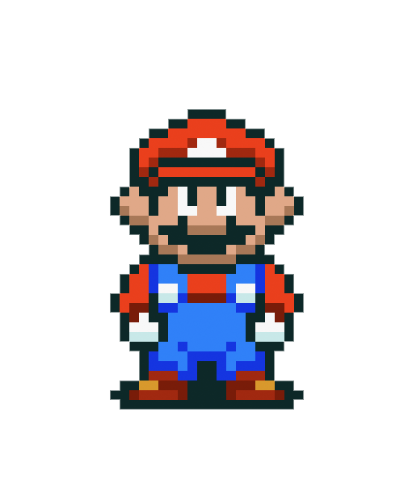

gifplayer
===========

Customizable jquery plugin to play and stop animated gifs. Similar to 9gag's

###Usage

1. Add a static version of the gif file to your website
2. Add a ‘data-gif’ attribute with the path to the animated gif image, or simply have an
3. image with the same same and the .gif extension in the same folder of the ‘preview’ image
4. Include jquery, gifplayer.js and gifplayer.css on your site
5. Call the .gifplayer() method for the desired images

```html



 
<script>
	$('.gifs').gifplayer();
</script>
```

###Options

Option	|Values	|Default
--- | --- | ---
label	|A value for the label in the circle over the image	|‘gif’
autoLoad	|true or false	|false
